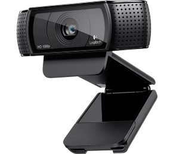

DLS Barcode Scanner Readme
==========================

This document is intended as an introduction for developers who are interested in maintaining or extending the DLS Barcode Scanner application.

Contents
--------
* Background and Description of Problem
* Using the Source Code
* [Data Matrix](docs/datamatrix.md)
* [Implementation Details](docs/implementation.md)

Background and Description of Problem
-------------------------------------
i04-1 is high throughput beamline at Diamond Light Source (see the [i04-1 site](http://www.diamond.ac.uk/Beamlines/Mx/I04-1.html) for more). Crystal samples to be imaged on the beamline are first loaded onto sample pins of the the kind pictured below:

 

Each sample pin has a datamatrix barcode printed on the top for identification and tracking:

Each sample pin is loaded into a numbered position in a storage puck which is then stored under liquid nitrogen until they are ready to be imaged on the beamline. When they are imaged, a robot arm removes the pin from the puck, scans the barcode, and places the sample in the beam. The x-ray image is then associated with the barcode number. The current 16-pin puck design as pictured below is produced by Crystal Positioning systems (see [The CPS website](http://www.crystalpositioningsystems.com/index.php?option=com_content&view=article&id=21)). In the future a new type of square 81-pin holder being developed in-house may also be used.

Once the samples have been loaded onto a pin and placed into a puck, the barcodes of each of the pins must be scanned in order to track the sample. Currently this is done with a small specialized barcode scanner that scans one barcode at a time. This takes several seconds per pin and is quite tedious. Also the reader is relatively expensive and difficult to configure.

The proposed solution to this problem is to create an application that can take an image of a puck from a standard camera, such as a webcam, and read the barcode from every pin, as well as determine each pin's numbered position. This would much quicker than individual scans and so would save a lot of time and frustration for beamline staff and users. Further such a solution would be very cheap to deploy as it would only require a copy of the application and a cheap off-the-shelf webcam. This means that it could be easily distributed to other institutions with similar requirements and external users who need to prepare sample pucks for imaging.

This repository contains an implementation of this solution.

Using the Source Code
---------------------
This application is written in Python (v3) and was developed under Windows but should be portable to other platforms.
 
Please see the [Setup Instructions](docs/SETUP.md) for details of how to prepare your environment to run this source code.
