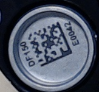
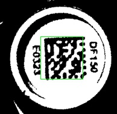

Data Matrix Locator
===================
Before we can read barcodes from an image, i.e., convert the matrix of black and white pixels into a text string, we must first locate them. In this context, locating means finding the coordinates (in image pixels) of each of the three corners of the data matrix finder pattern. 

In this application, we split the job of reading data matrix barcodes into two parts: 1) locating the barcodes in the image; and 2) reading the barcodes that we have found. The main reason for doing this is that the actual reading of the barcode is relatively expensive computationally. Splitting the functionality allows us to be selective about which barcodes we want to read, which is important in continuous scanning mode where it is likely that we will have read many of the barcodes already and so would waste considerable time if we re-read every barcode.

This application implements two different locator methods. The first (contours) is very fast, whereas the second (squares) is slower but can often locate barcodes that the first method misses. The code implementing these algorithms is found in `datamatrix\locate\`

The output of a locator procedure is a `FinderPattern` object which stores the position and orientation of a barcode, allowing it to be read at some later point.

When scanning an image, the contour locator algorithm is run first over the whole image. The geometry algorithm then uses the locations of the finder patterns that have been found to infer the geometry of the sample holder and thus the locations of all the slots in the sample holder. This means that if the contour locator misses any barcodes, we will still know roughly where they should be. We then run a more detailed version of the contour locator algorithm and/or the square finding algorithm on the small area around the slot in an effort to actually find (and then read) the barcode. 

Contour Locator Algorithm
-------------------------
The contour locator is quick to run but can occasionally have difficulty locating a barcode if the finder pattern is slightly damaged or dirty. Put simply, it works by finding places in the image where there are two straight lines at right angles to each other. The algorithm is described below

During the first stages of scanning a new image, the contour locator is run over the whole image. This will locate most of the barcodes in the image. These locations can then be used to determine the geometry of the sample holder and therefore which number slot each barcode likely occupies.

Here, the contour locator algorithm will be demonstrated with a small image containing a single barcode. The first step is to convert the image to grayscale:

 

### Threshold and Morph

Next we convert the image to black and white by applying an adaptive thresholding technique. This sets every pixel darker than a certain threshold colour to black and everything lighter to white. This is done intelligently as we don't use a single threshold for the whole image but rather the algorithm determines a threshold for each small area.  This black and white image is much easier for the subsequent contour finding algorithm to work with.

After applying the threshold, we also clean up the image a bit with a morphological 'Close' operation. This removes some noise and fills in some small gaps in the image.

The left-hand image below is the result of applying the adaptive threshold technique, and the right-hand image is the result of applying the close operation to that image.

 

See the OpenCV docs on [Thresholding](http://opencv-python-tutroals.readthedocs.io/en/latest/py_tutorials/py_imgproc/py_thresholding/py_thresholding.html) and [Morphological Transformations](http://opencv-python-tutroals.readthedocs.io/en/latest/py_tutorials/py_imgproc/py_morphological_ops/py_morphological_ops.html) for more details.

### Contours
Next we run a contour locator algorithm, which finds all of the contours in the black and white image. We then convert these contours into polygons or 'edge sets':

 

We are looking for shapes that are finder pattern-like, i.e., they contain two straight edges at right-angles to each other. We use a few filters to eliminate some of the polygons:

   

Finally, we convert any remaining polygons to finder patterns by extracting the straight edges:

Note that this technique is capable of finding multiple barcodes in a single scan of an image.

### Potential Problems
This algorithm does a good job of locating barcodes in most cases but it can occasionally miss a barcode. This normally happens if the barcode is dirty or if the finder pattern of the symbol is slightly damaged. In the following example the finder pattern cannot be correctly located because there is a small lighter-coloured patch in it: 

   

### Enhancements
There are 3 parameters that can alter the results of this algorithm: `blocksize` and `C`, which affect the adaptive thresholding operation, and `morphsize` which affects the morph operation. Varying these parameters will alter the form of the black and white image that the contour finder works on.

One method of getting better results (i.e., finding more finder patterns) is to simply run the algorithm multiple times over the same image with different values for these parameters.

Square Locator Algorithm
------------------------
As mentioned, sometimes the contour algorithm fails to find a barcode, however we can still infer its rough location from our knowledge of the sample holder's geometry. In this case we can use the Square finder algorithm as an alternative to locate the barcode finder pattern. The square finder algorithm is quite a lot slower than the contour method and can only be used to find a single barcode at a time but can often find barcodes that the contour method misses. It also requires us to know the approximate size of the barcode.

As with the contour method, first we convert the image to grayscale and then perform an adaptive threshold operation on it:

 

The procedure for locating the barcode is relatively simple. The barcode consists of a square region that is mostly dark, so we just need to look for the darkest square area in the image. 

First we define a square shape that is the same size as the barcode (the approximate barcode size must be supplied as a parameter to the algorithm), which is initially placed in the center of the image. To determine how 'dark' the square is, we simply count the number of black pixels in the square area. We then perform a number of iterations in which we either move the square by a small amount or rotate the image, and check if this new position results in a darker square. We keep going in this fashion till we've found the darkest square area (i.e., any further moves lead to a less dark area). This process is demonstrated below:

   

This tells us the location of the barcode but not the position of the finder pattern. We know the size (thickness) of the finder pattern bars (its just a percentage of the barcode size), so we just perform the same 'darkness check' on rectangular areas of the appropriate size at each of the four sides of the square. The two darkest adjacent edges will be the finder pattern.

### Issue - Barcode Size Too Small
If the approximate size supplied to the algorithm is a few pixels too small, the routine wont find the correct finder pattern. When this happens, the algorithm usually aligns the square properly on the barcode, and it will be correctly lined up on the finder pattern corner (as this is the darkest area). However because the supplied size is not correct, the finder pattern that is returned will be too small.

There are a few possible solutions to this problem that could be implemented:

 * After the square finder has run (but before locating the finder pattern), run a few more rounds of square finding but increase the size of the square. _Update: I tried this and it didn't seem to work very well. This is probably because a smaller size square will usually be darker on average as a larger percentage of the square will be taken up by the all-black finder pattern._
 * Instead of trying to resize the square, after the finder pattern has been located, try extending the size of the finder pattern.
 * Don't do anything in the square locator but instead try to change the size of the actual finder pattern object in the client code.
 

### Issue - False Square Location
In most cases, the barcode is a dark square on white background. This is because the sample pin is silver in colour and so ends up as white in the thresholded image. However there is writing above and below the barcode, and there can also be shadows which will end up as dark areas in the threshold image. Sometimes the square locator algorithm can get stuck on these darker areas as they represent a local optimum in darkness. 

Possible improvements which could increase the accuracy:

 * It might be possible to reduce this problem but altering the parameters of the adaptive threshold method slightly or by using a morphological operation. This might help to de-emphasize the text somewhat.
 * When performing the brightness calculations, instead of just looking in a square area, also look in the areas where we know the writing should appear. This might help to better orient the square. _Update: I've tried this and although it did actually work for some previously unresponsive examples, in general it greatly decreased the locator's effectiveness. I've left the relevant functions in the square locator class (but am not using them any more) as there may be a better way to use this functionality._
