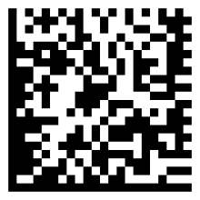
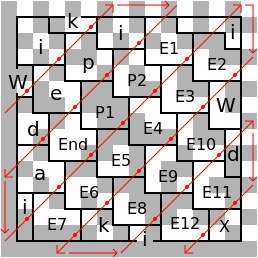
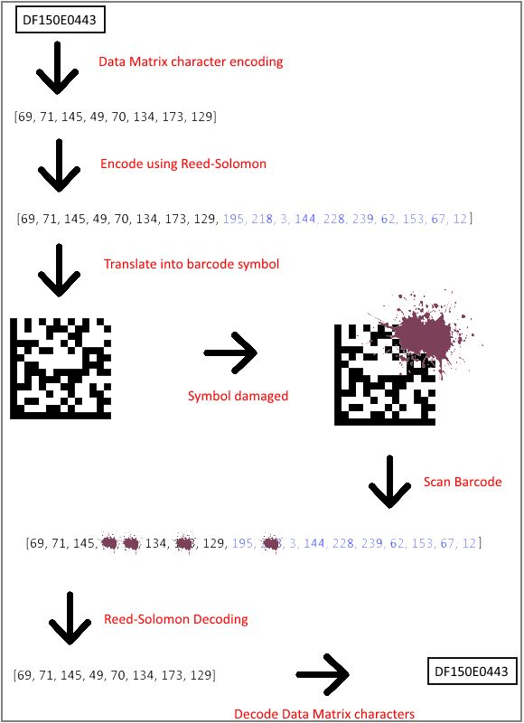

Data Matrix
===========
A Data Matrix is a type of two-dimensional barcode similar to the popular QR code. The [wikipedia page](https://en.wikipedia.org/wiki/Data_Matrix) contains an excellent summary and a full specification can be found at [barcode-reader.com](http://barcode-coder.com/en/datamatrix-specification-104.html). We will cover the important details here.

Data Matrix symbols are rectangular and are composed of a grid of pixels which represent bits (black for 1, white for 0).

Every Data Matrix is composed of two solid adjacent borders in an 'L' shape (called the 'finder pattern') and two other borders consisting of alternating dark and light 'cells' or modules (called the 'timing pattern'). Within these borders are rows and columns of cells encoding information. The finder pattern is used to locate and orient the symbol while the timing pattern provides a count of the number of rows and columns in the symbol.

While the symbols may vary in size from 10x10 to 144x144, **all of the barcodes we are currently using for the DLS barcode scanner are 14x14, with 12x12 data area, encoding 18 bytes.**

**Note: this document describes ECC 200 barcodes, which are the most recent type and the type used in the barcode reading application.** 
 
Encoding
--------
The Data Matrix symbol is divided into a series of shapes (often called 'Utahs'), each of which contains 8 pixels and thus encodes a single byte. The [Wikipedia article](https://en.wikipedia.org/wiki/Data_Matrix#Encoding) contains the following image which shows how the bytes for the string "Wikipedia" are encoded into the data matrix symbol:

The default encoding used is as follows:

| Byte Value | Interpretation             |
| ----------- | -------------------------- |
| 0           | Not used                    |
| 1 - 128     | ASCII data (ASCII value + 1) |
| 129         | End of message              |
| 130 – 229   | Digit pairs 00 – 99         |
| 230 - 241   | Other Datamatrix controls   |
| 242 - 255   | Not Used                    |

Error Correction Codes (ECC)
---------------------------
Data Matrix makes use of [Reed-Solomon](https://en.wikipedia.org/wiki/Reed%E2%80%93Solomon_error_correction) codes for error correction.

Under RS coding, a mathematical operation is run on the message (the series of `n` bytes) to be encoded. This generates another set of `t` ECC bytes which are appended to the original data bytes. The encoded message is then `n + t` bytes in size.

When decoding the encoding message, the reverse mathematical operation automatically discovers if any of the bytes have been corrupted or lost, and can regenerate the complete original message.  The maximum number of bytes that can be recovered if lost or corrupted is equal to `t/2`. Note that while this can recover from a substantial amount of damage done to the data area; if the L-shaped finder pattern is damaged, a barcode scanner may not be able to locate the barcode at all and therefore wont be able to read it.

When the data matrix barcodes are created, the message is encoded using Reed-Solomon codes, and then the encoded message (data + ECC bytes) is translated into a barcode symbol.

In the barcode scanner application, it is expected that all barcodes have the **first 8 bytes used for data (including 1 for the end-of-message byte) and 10 for ECC (18 bytes total)**. Note that it is possible for the data matrix to encode more than 8 characters with 8 data bytes because some values in the data matrix specification encode digit pairs (00-99) in a single byte.

Data Matrix Workflow
-----------------------------
The process of translating a message into a Data Matrix and reading it back again is summarized in the following diagram

