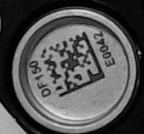
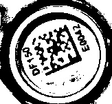
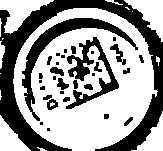
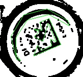
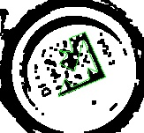
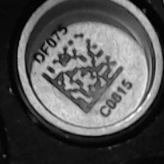

Data Matrix Locator
===================
Before we can read barcodes from an image, i.e., convert the matrix of black and white pixels into a text string, we must first locate them. In this context, locating means finding the coordinates (in image pixels) of each of the three corners of the data matrix finder pattern. 

In this application, we split the job of reading data matrix barcodes into two arts: 1) locating the barcodes in the image; and 2) reading the barcodes that we have found. The main reason for doing this is that the actual reading of the barcode is relatively expensive computationally. Splitting the functionality allows us to be selective about which barcodes we want to read, which is important in continuous scanning mode where it is likely that we will have read many of the barcodes already and so would waste considerable time if we re-read every barcode.

This application implements two different locator methods. The first (contours) is very fast, whereas the second (squares) is slower but can often locate barcodes that the first method misses.

The output of a locator procedure is a Finder Pattern object which stores the position and orientation of a barcode, allowing it to be read at some later point.

When scanning an image, the contour locator algorithm is run first over the whole image. The geometry algorithm then uses the locations of the finder patterns that have been found to infer the geometry of the sample holder and thus the locations of all the slots in the sample holder. This means that if the contour locator misses any barcodes, we will still know roughly where they should be. We then run a more detailed version of the contour locator algorithm and/or the square finding algorithm on the small area around the slot in an effort to actually find (and then read) the barcode. 

Contour Locator Algorithm
-------------------------
The contour locator is quick to run but can occasionally have difficulty locating a barcode if the finder pattern is slightly damaged or dirty. Put simply, it works by finding places in the image where there are two straight lines at right angles to each other. The algorithm is described below

During the first stages of scanning a new image, the contour locator is run over the whole image. This will locate most of the barcodes in the image. These locations can then be used to determine the geometry of the sample holder and therefore which number slot each barcode likely occupies.

Here, the contour locator algorithm will be demonstrated with a small image containing a single barcode. The first sep is to convert the image to grayscale:

 

### Threshold and Morph

Next we convert the image to black and white by applying an adaptive thresholding technique. This sets every pixel darker than a certain threshold colour to black and everything lighter to white. This is done intelligently as we don't use a single threshold for the whole image but rather the algorithm determines a threshold for each small area.  This black and white image is much easier for the subsequent contour finding algorithm to work with.

After applying the threshold, we also clean up the image a bit with a morphological 'Close' operation. This removes some noise and fills in some small gaps in the image.

The left-hand image below is the result of applying the adaptive threshold technique, and the right-hand image is the result of applying the close operation to that image.

 

See the OpenCV docs on [Thresholding](http://opencv-python-tutroals.readthedocs.io/en/latest/py_tutorials/py_imgproc/py_thresholding/py_thresholding.html) and [Morphological Transformations](http://opencv-python-tutroals.readthedocs.io/en/latest/py_tutorials/py_imgproc/py_morphological_ops/py_morphological_ops.html) for more details.

### Contours
Next we run a contour locator algorithm, which finds all of the contours in the black and white image. We then convert these contours into polygons or 'edge sets':
 

We are looking for shapes that are finder pattern-like, i.e., they contain two straight edges at right-angles to each other. We use a few filters to eliminate some of the polygons:

   

Finally, we convert any remaining polygons to finder patterns by extracting the straight edges:

### Potential Problems
This algorithm does a good job of locating barcodes in most cases but it can occasionally miss a barcode. This normally happens if the barcode is dirty or if the finder pattern of the symbol is slightly damaged. In the following example the finder pattern cannot be correctly located because there is a small lighter-coloured patch in it: 

   

### Enhancements
There are 3 parameters that can alter the results of this algorithm: `blocksize` and `C`, which affect the adaptive thresholding operation, and `morphsize` which affects the morph operation. Varying these parameters will alter the form of the black and white image that the contour finder works on.

One method of getting better results (i.e., finding more finder patterns) is to simply run the algorithm multiple times over the same image with different values for these parameters.

Square Locator Algorithm
------------------------