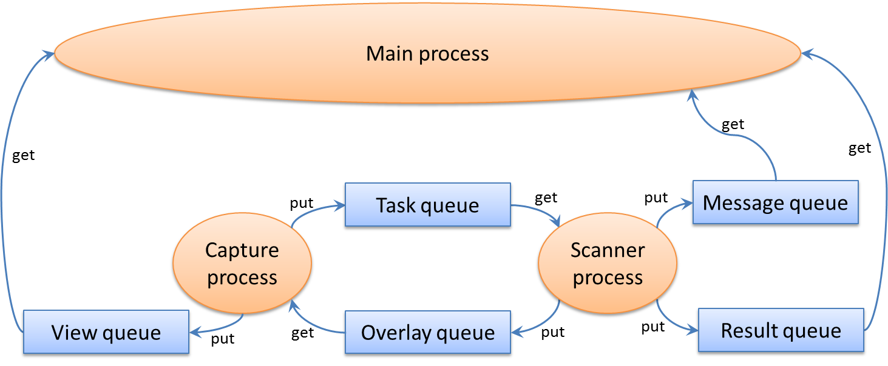

Continuous Barcode Scanning
===========================
The barcode scanner can be used to scan a puck from an image file, however the major intended use case is to have the scanner continuously taking image frames from an attached webcam.

Data Flow Between Processes
---------------------------
The Camera Scanner starts two sub-processes: the Capture Process and the Scanner Process. Below is a schematic of the overall data flow between processes.

The Capture Process acquires frames from the camera; all the frames are pushed to the View Queue for display, but only some are pushed to the Task Queue for analysis. The Scanner Process pulls the frames from the Task Queue for scanning. The result of the scan (i.e. the barcodes) are pushed to the Result Queue and finally pulled by the main thread.

The Scanner Process also generates the overlays that must be super-imposed to the image and displayed to the user in the GUI. The Scanner Process pushes the overlays in the Overlay Queue. The Capture Process pulls the overlays and draws them on the latest image, which is then pushed to the View Queue. The main thread pulls the images from the View Queue and displays them to the user.

