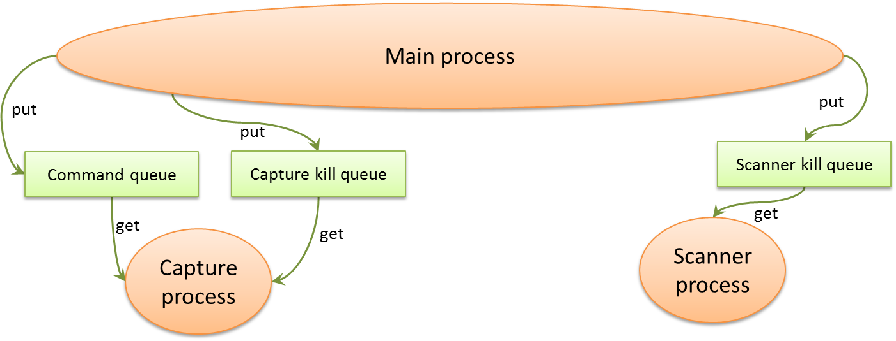

Continuous Barcode Scanning
===========================
The barcode scanner can be used to scan a puck from an image file, however the major intended use case is to have the scanner continuously taking image frames from an attached webcam.

Data Flow Between Processes
---------------------------
The Camera Scanner starts two sub-processes: the Capture Process and the Scanner Process. Below is a schematic of the overall data flow between processes.

The Capture Process acquires frames from the camera; all the frames are pushed to the View Queue for display, but only some are pushed to the Task Queue for analysis. The Scanner Process pulls the frames from the Task Queue for scanning. The result of the scan (i.e. the barcodes) are pushed to the Result Queue and finally pulled by the main thread.

The Scanner Process also generates the overlays that must be super-imposed to the image and displayed to the user in the GUI. The Scanner Process pushes the overlays in the Overlay Queue. The Capture Process pulls the overlays and draws them on the latest image, which is then pushed to the View Queue. The main thread pulls the images from the View Queue and displays them to the user.

Messages Between Processes
--------------------------
Below is a schematic of how the Camera Scanner in the main thread communicates with the Capture and Scanner sub-processes.

The Capture Process is instantiated only once and is always running: this way, the time-consuming initialisation of the cameras is done only once and only the streams are switched (i.e. frames from either camera are pushed to the View Queue). The Command Queue is used by the main thread to control switching from one camera to the other (Start command: start streaming and from which camera; Stop command: stop all streaming).

The Capture Kill Queue is used to terminate the Capture Process. This is done when:
	* the program is shut down
	* any time the user changes the configuration from the Options dialog (because some camera options may have changed and they might need to be re-initialised anyway)
	
The Scanner Process doesn't need to be running all the time, so it's only instantiated when the stream is active. Whenever a Stop command is issued to the Capture Process, a Kill command is sent to the Scanner process through its Kill Queue.

