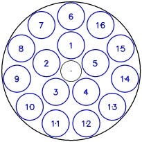
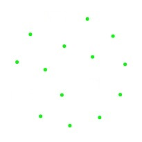

Unipuck Geometry Calculation
============================
The datamatrix barcodes are printed on top of sample pins which are loaded into a CPS Unipuck sample holder (see [problem description](docs/problem.md) for more details).

As you can see in the image, each slot in the puck is individually numbered. When the barcode scanner application is used to scan a puck, it is important that each barcode is associated with the correct slot number as this information is used later when the sample comes to be imaged on the beamline.

Simply reading the barcodes from the image does not give us this information so we need another method to determine the slot number of each barcode.

We can calculate the slot number of each barcode from our knowledge of the positions of all the barcodes. The calculation is done by the `UnipuckCalculator` class (`geometry\unipuck_calculator.py`). The layout of a puck is stored in a `Unipuck` object (`geometry\unipuck.py`), which can be used to get the slot number of the barcode at a given position.

Template
--------
We define a template (`geometry\unipuck_template.py`) of a puck and attempt to fit our set of observed barcode positions to this template.

The puck has 16 slots arranged in two concentric circles with 5 slots equally spaced in the inner circle and 11 slots equally spaced in the outer circle. The inner circle contains slots 1-5 numbered sequentially anti-clockwise, and the outer contains slots 6-16 also numbered sequentially anti-clockwise. 

A straight line can be drawn from the center of the puck through the centers of slot 1 (in the inner layer) and slot 6 (in the outer layer) but not through any other pair of slots which means that the unipuck has no rotational symmetry. 

If the puck has a radius of 1 then each slot has a radius of about 0.2, and the radii of the inner and outer layers are 0.37 and 0.79 respectively (distance from puck center to the center of a pin in the layer).

The image below is a representation of this template.

We have the list of locations of the barcodes. Note that it is possible that some of the slots will not have pins in them, therefore we may not have a complete set of 16 points. The set of barcode locations, with a few missing, may look something like this:

To establish which barcode belongs in which numbered slot, it is therefore simply a matter of trying to fit this set of locations on to the template. 

Given all of the information about the puck template above, we can uniquely define the location and layout of a puck in an image as long as we know: i) the center location (x,y) in pixel coordinates; ii) the puck radius in pixels; and iii) the puck orientation, where 0 degrees is defined as the position with slots 1 and 6 pointing straight up. If we can work out all 3 of these, it is trivial to calculate the position of each numbered slot and therefore which barcode corresponds to which slot. 

To work out the thee values we can either use optimisation calculations (geometry/unipuck_calculator.py) or image processing (geometry/unipuck_locator.py).

Both of the methods are in use at the moment. The image processing works even when there is only one non-empty slot in the puck. It can quickly find the position of the puck
when the image quality is good.
The optimisation calculations require at least 8 slots of the puck to be non-empty but don't depend as heavily on the image quality.
Hence we start with the image processing and only if it fails finding the feature we use the optimisation calculations.

Image Processing
----------------

Center and Puck Radius Detection
--------------------------------
The center and the radius of a puck can be detected in the puck image using a build in opencv method called minEnclosingCircle. The function returns minum enclosing circle of a given contour in a image. It returns both the radius and the center of the circle.

Orientation Detection
---------------------
We observed that the puck has a characteristic round cut on the edge, which is further called feature.
Once we detect the position of the feature we can calculate the position of the puck. The feature is positioned pi/2 rad from the puck orientation.
The feature can be detected in the image relatively easy if the image background is even:
 * create an empty black image of sie of the original image
 * draw white circle in the black image using the detected center and radius of the puck
 * draw the largest contour found in the image in black
 * use open morphology filter to remove small white artifacts from the image
 * the result is a mask showing small white features on black background
 * use build in opencv method called match shape to find the shape of the feature (uses a simplified image of the feature)

Optimisation Calculations
-------------------------

Center Calculation
------------------
If we knew for sure that we would always have the locations of all 16 barcodes, the center of the puck could be easily established by calculating the centroid (average position) of all the points. However if any of the points are missing then this calculation would not give the correct result and the position could be skewed significantly, particularly if several points on one side of the puck were missing. We therefore take a slightly more sophisticated approach.

The algorithm works as follows:

 * Start by calculating the centroid (as this gives us a rough guess of the center position).
 * Calculate the distance from each point to the centroid.
 * Use these distances to partition the points into two groups (inner layer will have a much shorter average distance than the outer layer).
 * For each layer, calculate a position that is equidistant from all the points in the layer. This is the puck center.

Size Calculation
----------------
Once we know the center position, calculation of the size (puck radius) is straightforward.

 * Take the list of the points in the outer layer (established in the center calculation).
 * Calculate the average distance from a point in the outer layer to the puck center
 * puck radius = outer_layer_radius / 0.79 (as we know the outer layer radius is 0.79*puck radius)

Orientation Calculation
-----------------------
Once we have the puck center position and size, we can find the correct orientation (rotation) by simply rotating the template to a number of different positions and seeing which angle best fits the observed barcode points.
 
We use 2-degree increments, so try 180 different angles. For each angle we calculate the error, and the angle with the smallest error is the correct position.

For a given angle, for each barcode point, the error is simply the distance from the point to the nearest template slot center. The total error for the angle is then the some of the errors of every point.

Empty Slots
-----------
It may sometimes be the case that there aren't enough barcodes in the puck to correctly calculate a unique orientation. If for example there were only barcodes in the 5 slots of the inner layer, then there would be 5 equivalent orientations which would give a best fit. In this case, we can often obtain more pin position points to use with the geometry algorithm by looking for empty slots in the puck (i.e., slots without a pin).

Because of the way the pucks are made, empty slots appear as black circles in an image of the puck. An algorithm called HoughCircles can be used to locate circles in an image. This algorithm produces much better results and is vastly more efficient if the size and separation of the circles you are looking for are known. The approximate size of the circles (as they appear in the image) can be calculated from our knowledge of the size of the barcodes that we have found, and of course we know their separation from the geometry of the puck.

If we have detected a low number of barcodes, we run this algorithm on the image and will usually locate most of the empty slots. The center points of these circles roughly correspond to the center of the slot so these points can then be fed into the geometry calculation algorithm. This means that we can accurately determine the slot position of a barcode in the puck, even if there is only a single barcode.

The center of the empty slot circles are slightly closer to the center of the puck than the center of the barcodes. This means that if there are a large number of empty slights, the algorithm calculates that the radius of the puck is smaller than it actually is, though this doesn't usually affect the accuracy of the results. 
 
Note that we don't use this technique to actually specify whether a slot is empty or not because the circle finder algorithm will often find the pins as well (for that we use a different algorithm that examines the relative brightness of each slot).

